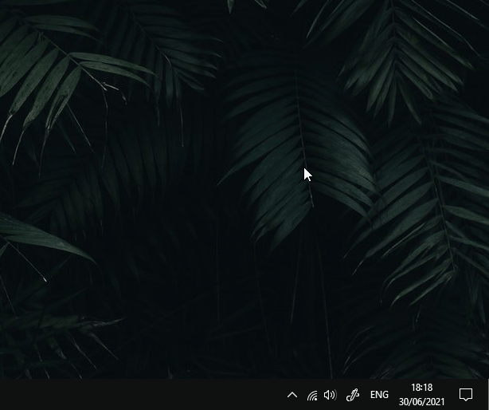

<h1 align="center">
   
  
   
  QuickKey
   
  
  
  
  
</h1>

<h4 align="center">A small Windows application to quickly find special characters and copy them to your clipboard in an instant, without disturbing your workflow.</h4>

## Usage

When in need of a special character while writing
1. Press the *QuickKey*-Hotkey to open up a search window. (default: `Ctrl Y`)
2. Type  a description of you desired character like **integral** for **∫**.
  > While typing you will see characters whos tags match your typed words.
  > Seperate tags with a space.
3. As soon as you see your desired character click it to copy it to your clipboard or, if in first position, just press **Enter** to copy.

Alternatly you may browse all charcters, search for specific topics or just type the character-code to find you character.

## Install

> There are two ways to install *QuickKey*.\
> Either install it using the provided installer or build it on your own.

### Installer

Download the latest release from [here](https://github.com/leokraft/QuickKey/releases).\
Run the installer and follow the instructions.
  
### Build

> Make sure you have `qmake` installed and added to your PATH.\
> If not have a look [here](https://www.qt.io/download-qt-installer).

Clone the repository, and run `qmake quickkey.pro` to create your own Makefile.\
To build run `make` or `mingw32-make` depending on what you have installed.\
Afterwards run the produced `QuickKey`-binary inside the release folder.

## Configuration 

A selection of configuration options

- light/darkmode
- window appearance position
- ~~hotkey to open *QuickKey* search window
- ~~custom tags/topics for characters
- ~~language (en/de)

all these options are available under the settings.

### Acknowledgement

This application is written using the Qt 6.1.1 Open Source version under the GPLv3 License.
